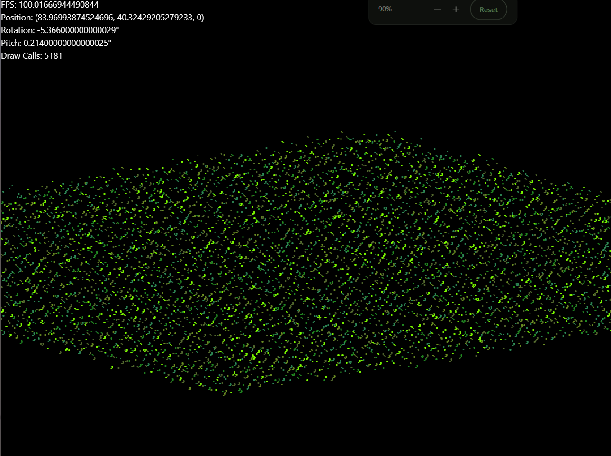

# 3D ASCII Tiles

A browser-based 3D isometric renderer that displays ASCII characters as textured tiles in a WebGL-powered world. Fly through a procedurally generated terrain of characters with a free-look camera.



<video controls src="20260417-1938-17.2994253.mp4" title="preview"></video>

## Getting Started

```bash
bun install
bun dev
```

Open `http://localhost:5173`. Click the canvas to lock the mouse pointer, then use WASD + mouse to move.

## Controls

| Input | Action |
|-------|--------|
| `W / A / S / D` | Move camera |
| Mouse | Look around |
| `Esc` | Release mouse pointer |

## Tech Stack

- **TypeScript** — strict mode
- **Vite + SWC** — dev server and bundler
- **Regl** — WebGL abstraction layer
- **React 18** — HUD and UI overlay
- **Tailwind CSS** — UI styling
- **Bun** — runtime and package manager

## Architecture

The engine uses a two-layer approach: a WebGL canvas for 3D rendering and a React overlay for the HUD.

```
src/
  core/        Game loop (requestAnimationFrame, delta time, FPS tracking)
  entities/    Entity-Component System — Entity, Transform, EntityManager
  render/      WebGL renderer (Regl), Camera, ASCII atlas builder
  map/         TileMap (400×400 grid), Tile (char, color, height, light)
  ui/          React HUD (FPS, position, rotation, draw calls)
  utils/       Input (WASD + pointer lock), Signal (observer pattern)
```

**Rendering pipeline:**
1. Build a character atlas texture (all char/color combos on one canvas)
2. Cull tiles outside the view distance
3. Sort visible tiles by screen Y (painter's algorithm)
4. Batch all visible tiles into a single WebGL draw call

## Scripts

```bash
bun dev       # development server with hot reload
bun build     # production build
bun preview   # preview production build
bun run lint  # lint with ESLint
bun test      # run tests
```
